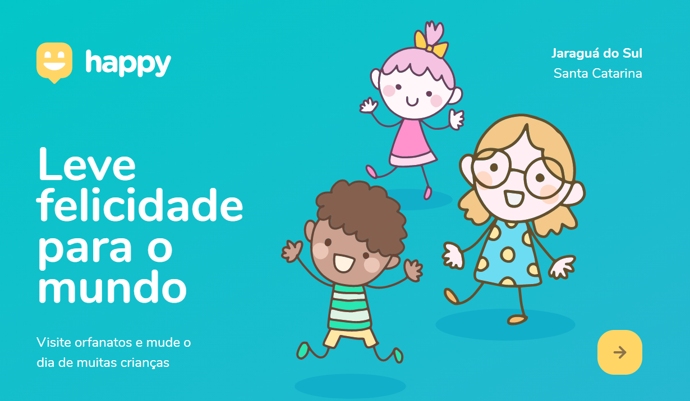
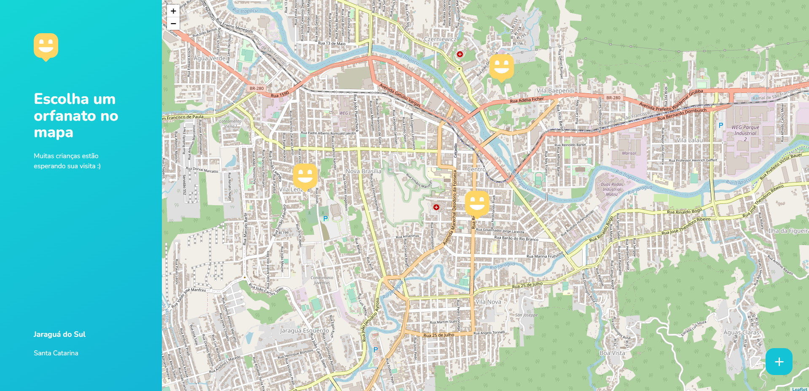

# Happy

Project developed at **Next Level Week 3** taught by [Rocketseat](https://rocketseat.com.br/).

The project aims to bring people together with orphanages and homes for children, encouraging visits to share empathy, love, care and attention.

🥰🙏🏼

----
## 🖼️ Screenshots 

 

----

## 💡 Techs
      

----

## ⚙️ How to Use
>
> ➝ Clone this repository:
> 
> `git clone https://github.com/bentodvictor/happy.git Happy`
> 
> ➝ Enter in directory:
> 
> `cd Happy`
> 
> ➝ For install dependencies:
> 
> `npm i`
> 
> ➝ Execute application:
> 
> `npm start`
> 
> ➝ Open your browser in: `http://localhost:5500/`
